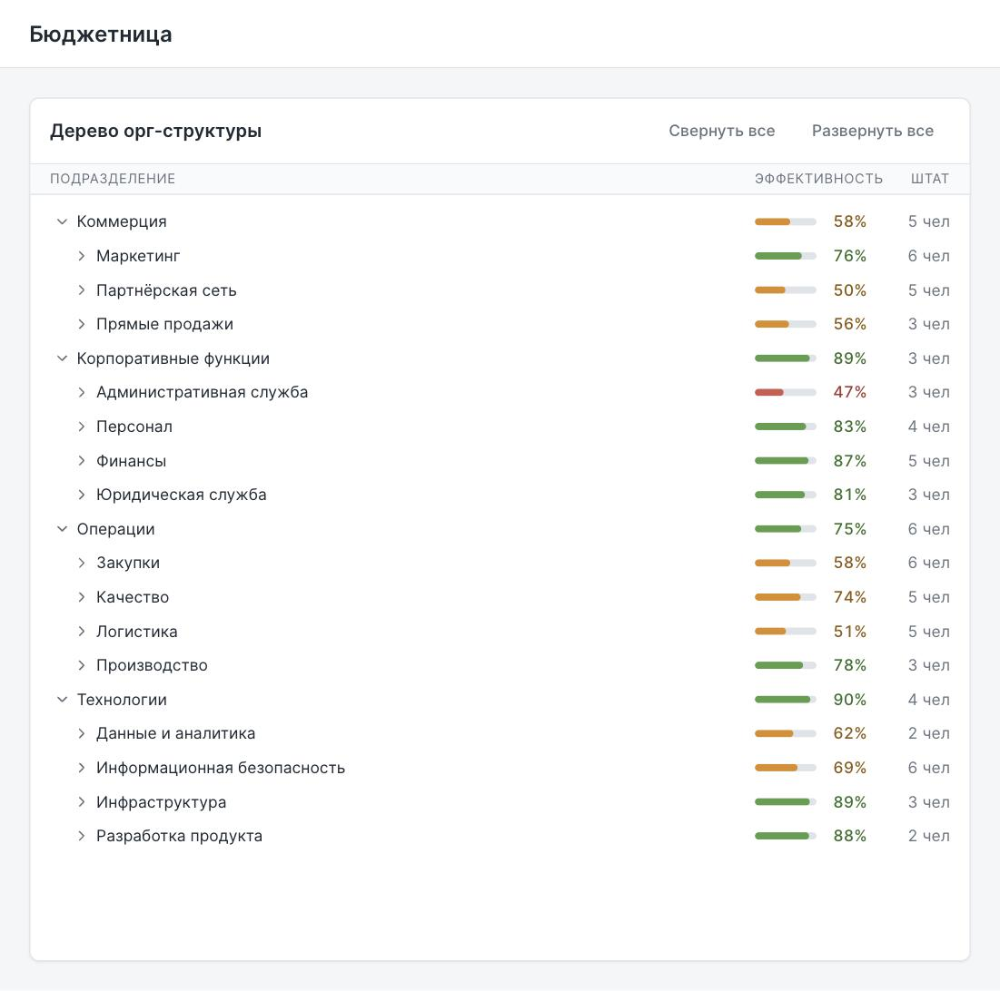
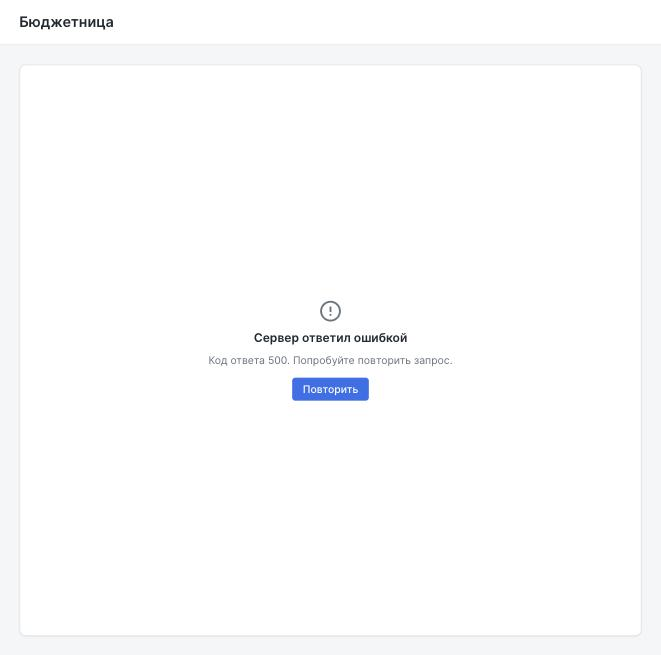
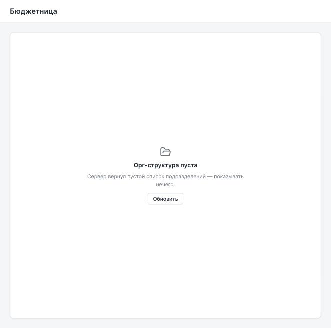

# Бюджетница

Дашборд мониторинга орг-структуры компании: дивизионы → отделы → команды, у каждого узла численность,
бюджет и эффективность. Тестовое задание, условия — в [`task/task.md`](task/task.md).



## Запуск

```bash
npm install
npm run dev          # сервер :3000 и клиент :8080 одной командой
```

Нужен Node 22 (`.nvmrc`). Клиент открывается на http://localhost:8080 и ходит в API через прокси Vite —
тот же origin, что в проде за Nginx.

| Команда          | Что делает                                   |
| ---------------- | -------------------------------------------- |
| `npm run dev`    | поднимает mock-сервер и клиент               |
| `npm run verify` | typecheck + линтер + тесты (то же, что в CI) |
| `npm test`       | Vitest по трём пакетам                       |
| `npm run build`  | прод-сборка клиента                          |
| `npm run size`   | размер сборки против бюджета 200 КБ gzip     |

### Отладочные состояния

При `MOCK_DEBUG=1` (включён в `npm run dev`) параметры адреса прокидываются в API, и состояния можно
посмотреть руками:

| Адрес          | Состояние               |
| -------------- | ----------------------- |
| `/?delay=3000` | загрузка (скелетон)     |
| `/?fail=1`     | ошибка сервера          |
| `/?invalid=1`  | ответ не проходит схему |
| `/?empty=1`    | пустой ответ            |

 

## Что сделано (этап 01 FOUNDATION)

- **Монорепо** npm workspaces: `apps/client`, `apps/server`, `packages/contracts` с общими zod-схемами.
- **Mock-API** `GET /api/org-tree` — плоский массив из 61 узла на трёх уровнях, детерминированный сид.
  Версия данных едет в `ETag`, поддержан условный запрос и `304`.
- **Слой данных** — react-query со stale time 5 секунд, валидацией ответа на клиенте и отменой запроса
  при размонтировании. В кэше лежит готовая модель дерева, а не сырой массив.
- **Дерево** — ветка раскрывается кликом по всей строке (в шеврон целиться не нужно), у каждого узла имя,
  штат и индикатор эффективности; по умолчанию раскрыты корни, то есть видно два уровня.
- **Состояния** — загрузка, ошибка (отдельные тексты для схемы, целостности, HTTP и сети), пустой ответ.
- Стилизация только на styled-components, инлайн-CSS запрещён линтером.

**Размер сборки:** 379 КБ raw → **117 КБ gzip** при бюджете 200 КБ.

### Прочтения условий, которые стоит проговорить

- «Второй уровень открыт по умолчанию»: при загрузке видно два уровня — дивизионы и отделы. Команды
  раскрываются по клику, иначе дерево открыто целиком и сворачивать нечего.
- «Невалидный ответ — ошибка» распространено и на лишние поля: схема узла строгая.
- Нарушение целостности (дубликаты id, сироты, циклы) — тоже ошибка, а не повод показать часть дерева.

## Документация

- [`docs/architecture.md`](docs/architecture.md) — слои и поток данных от API до UI
- [`docs/data-model.md`](docs/data-model.md) — модель дерева, ревизия данных, целостность
- [`docs/adr/`](docs/adr/) — решения: стек, слой данных, агрегация, live-обновления, стилизация
- [`docs/plan.md`](docs/plan.md) — план по этапам
- [`docs/ai-log.md`](docs/ai-log.md) — сырьё для раздела ниже

## AI в разработке

Раздел будет дополняться по мере этапов; полный журнал — в [`docs/ai-log.md`](docs/ai-log.md).

Инструмент — Claude Code. Схема работы: сначала фиксируются решения (ADR) и план, потом по ним пишется код;
каждый нетривиальный выбор объясняется в ADR, а не в чате.

**Что сгенерировано моделью:** черновики ADR и плана, scaffold монорепо и конфигурация инструментов,
mock-сервер с детерминированным сидом, `buildModel` с проверкой целостности, слой запроса, тема и примитивы,
компоненты дерева, тесты ко всему перечисленному, документация.

**Что решено и поправлено человеком:** стек и запреты (React, Vite, TypeScript, zod, react-query, WebSocket,
пересчёт вверх по нодам, exponential backoff, styled-components без дизайн-системы), макет и схема деплоя,
процесс «ветка на этап». Автор указал на дыру в версионировании при рестарте сервера — из неё выросла
ревизия `{ epoch, version }` вместо одного счётчика. Он же принял решения по поиску, колонке «Штат» и
переносу клавиатуры дерева на этап 03.

**Что модель нашла и исправила сама, проверяя работу:** подсветка обновлений через `key` мигала бы при
первой отрисовке; `applyPatch`, вернув `null`, отравил бы кэш; `cancelRefetch` стоял не в том аргументе;
`typescript@latest` и `eslint@latest` несовместимы с линтером. Отдельно — экран ошибки не появлялся вовсе,
пока не выяснилось, что react-query выставляет `error` только после исчерпания ретраев, а в неактивной
вкладке ретраи ставятся на паузу; это нашлось запуском приложения, а не чтением кода.
