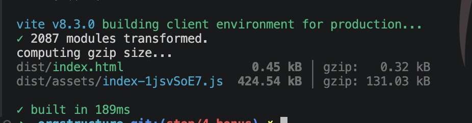

Сервис поднимается командой

```bash
docker compose up --build     # http://localhost:8080
```

Есть все, live-обновление, деградация, таблица и дерево, AI-поиск, но он привязан к ANTHROPIC_API_KEY

В целом работу сервиса можно посмотреть в видео-ряде

[Запись работы сервиса (54 c, 14 МБ)](docs/screenshots/ai-search.mov) — GitHub такие файлы не проигрывает
прямо в README, файл открывается по ссылке. Короткий фрагмент с живыми обновлениями есть картинкой в
[README.md](README.md#этап-03-polish).

### Человек и AI

Мной был накидан дизайн и архитектура будущего решения - можно посмотреть в папке ./task.

Дальше на шаге 0 задал Claude технологии, которые будем использовать, что синхронизация по websocket, а дерево будем обходить вверх при перерасчете без подтягивания children

Накидали ADR основных моментов, перечитал, поправил несколько косяков и запустил в генерацию

Дальше на каждом шаге UI-тестирования, тестирование расчетов и рендеров. На каждом степе по пачке больших правок получалось.

И зафиналил отсъемкой кадров и бандл сайзом: 414,7 КиБ → **126,6 КиБ gzip** по `npm run size`
(Vite на скриншоте печатает те же байты как 424,5 kB → 131 kB — у него килобайт по 1000, а не 1024).


